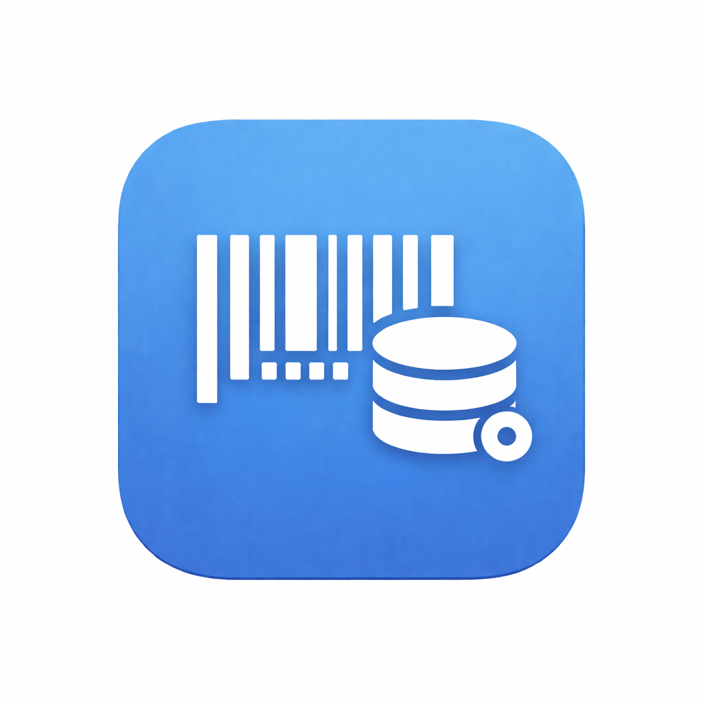

# SecGo — 便利店离线自助结账系统

[English](README.md) | [中文](README_zh.md)


<table>
  <tr>
    <td align="center" width="33%">
      
      <br />
      <b>管理端</b>
      <br />
      <sub>店主工具</sub>
    </td>
    <td align="center" width="33%">
      
      <br />
      <b>自助端</b>
      <br />
      <sub>顾客结账</sub>
    </td>
    <td align="center" width="33%">
      
      <br />
      <b>Server</b>
      <br />
      <sub>可选后端</sub>
    </td>
  </tr>
</table>

SecGo 是面向小型超市/便利店的一体化自助结账生态系统。包含两款 Flutter 应用（管理端 + 自助端），并支持可选的后端服务。系统强调**离线可用**、**二维码配对**与**点对点同步**。

---

## ✨ 组件概览

| 组件 | 角色 | 亮点 |
| --- | --- | --- |
| **管理端 App** | 店主使用 | 商品管理、二维码上传、终端同步与备份 |
| **自助端 Kiosk App** | 顾客使用 | 连续扫码、购物车、支付二维码展示 |
| **Server（可选）** | 旧版/中心服务 | API 查询与二维码存储（可选） |

---

## 🧭 核心功能

### 🏢 管理端 App
- **商品管理**：扫码录入，支持 API 自动填充
- **终端配对**：扫码即配对
- **同步与备份**：推送商品、备份/恢复
- **离线优先**：本地数据库 + 可选 API 增强

### 🛒 自助端 Kiosk App
- **快速结账**：连续扫码 + 实时购物车
- **支付二维码展示**
- **管理员模式**：隐藏手势 + PIN
- **内置服务端**：接收管理端推送
- **终端友好**：平板布局 + 熄屏保护

---

## 🔗 同步流程（二维码配对）
1. **Kiosk** → 设置 → 启动服务（需 PIN）
2. **管理端** → 配对终端 → 扫描二维码
3. **管理端** 推送商品至 Kiosk

---

## 🧰 环境变量

### 管理端（`Manager/.env`）
```
ALI_CLOUD_APP_CODE=your_api_key_here
STORE_NAME=YOUR_STORE_NAME
```

### 自助端（`Kiosk/.env`）
```
STORE_NAME=YOUR_STORE_NAME
```

> 模板文件：`Manager/.env_template` 与 `Kiosk/.env_template`

---

## ▶️ 快速开始

### 1) 运行管理端
```bash
cd Manager
flutter pub get
flutter run
```

### 2) 运行自助端
```bash
cd Kiosk
flutter pub get
flutter run
```

---

## 🤖 CI 与发布自动化

- **CI**：每次推送/PR 自动执行 lint + 测试。
- **Release**：每次 push 到 `main` 自动构建 APK，并发布 GitHub Release。

---

## 📁 目录结构

```
Manager/   # 管理端应用
Kiosk/     # 自助端应用
Server/    # 可选 Rust 后端
.github/   # CI 与发布工作流
```

---

## 📝 许可证

MIT — 详见 [LICENSE](LICENSE)。
